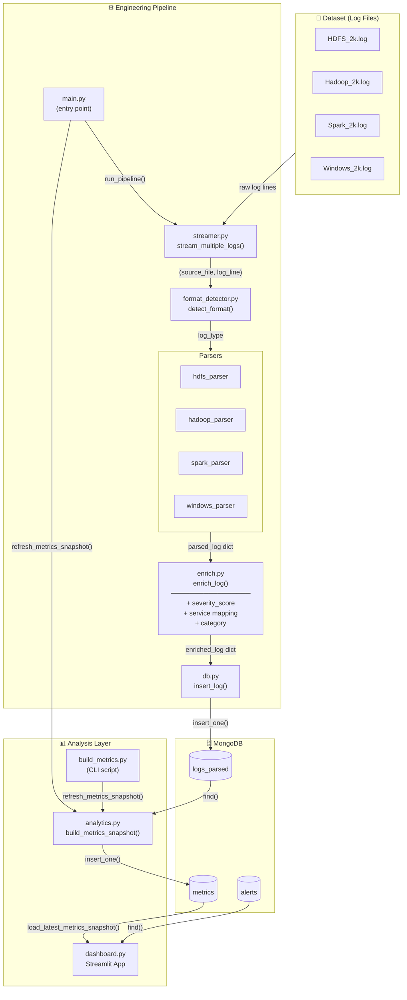

# Log Data Pipeline

A batch log ingestion and analysis system that streams, parses, enriches, and persists structured log data from multiple distributed-system sources into MongoDB, then serves a real-time Streamlit dashboard backed by pre-computed analytics snapshots.

## System Architecture



## Components

| Layer | Module | Responsibility |
|-------|--------|----------------|
| **Dataset** | `dataset/*.log` | Raw log files for HDFS, Hadoop, Spark, and Windows |
| **Streaming** | `engineering/streamer.py` | Reads log files line by line, yielding `(source_file, log_line)` tuples |
| **Detection** | `engineering/format_detector.py` | Classifies each line as `hdfs`, `hadoop`, `spark`, `windows`, or `unknown` using timestamp patterns, component identifiers, and keyword matching |
| **Parsing** | `engineering/parsers/` | Format-specific parsers that extract structured fields (timestamp, level, component, message, entity IDs) |
| **Enrichment** | `engineering/enrich.py` | Adds `severity_score`, `service`, `category`, and `processed_at` to parsed logs |
| **Persistence** | `engineering/db.py` | MongoDB client — inserts logs, manages indexes, queries for dashboard use |
| **Orchestration** | `engineering/pipeline.py` | Coordinates the stream → detect → parse → enrich → store loop |
| **Entry Point** | `engineering/main.py` | Runs the full pipeline then triggers a metrics snapshot refresh |
| **Analytics** | `analysis/analytics.py` | Loads `logs_parsed` from MongoDB, normalises data, computes KPIs and distributions, persists snapshots to `metrics` |
| **Metrics CLI** | `analysis/build_metrics.py` | Standalone script to rebuild the latest analytics snapshot |
| **Dashboard** | `analysis/dashboard.py` | Streamlit app that reads the latest `metrics` snapshot and renders KPI cards, charts, and log tables |

## Data Flow

1. **Ingest** — `main.py` calls `run_pipeline()`, which streams every line from the four log files, detects its format, routes it to the matching parser, enriches the result, and writes it to the `logs_parsed` MongoDB collection.
2. **Analyse** — `main.py` (or `build_metrics.py`) calls `refresh_metrics_snapshot()`, which reads all parsed logs, computes aggregations and distributions, and persists the result to the `metrics` collection.
3. **Visualise** — The Streamlit dashboard loads the most recent `metrics` snapshot (plus any `alerts`) and renders an interactive monitoring view.

## Quick Start

```bash
# 1. Install dependencies
pip install -r analysis/requirements.txt

# 2. Start MongoDB (default: localhost:27017)

# 3. Ingest logs and build the metrics snapshot
python engineering/main.py

# 4. Launch the dashboard
streamlit run analysis/dashboard.py
```

## Tech Stack

- **Python 3.10+**
- **MongoDB** — log storage and analytics snapshots
- **PyMongo** — database driver
- **Pandas** — data normalisation and aggregation
- **Streamlit** — interactive web dashboard
- **Plotly** — charts and visualisations
